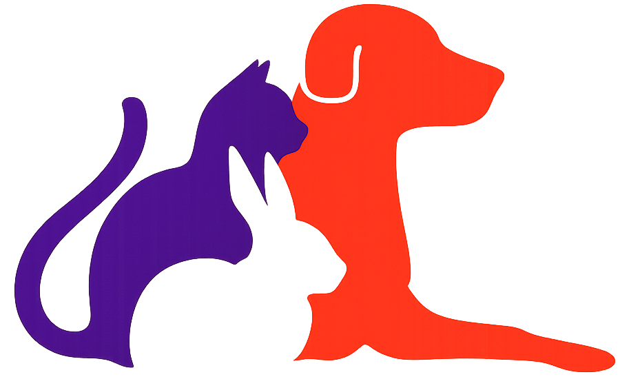

<div align="center">



# Petora — Frontend

**A bilingual pet-care marketplace for South Korea.**
Book grooming, walking, training and veterinary services from verified agents — and shop pet products — in one place.

[](https://nextjs.org)
[](https://react.dev)
[](https://www.typescriptlang.org)
[](https://www.apollographql.com/docs/react)
[](https://mui.com)
[](#85-internationalisation-i18n)

**[English](#english) · [한국어](#korean)**

</div>

---

<a id="english"></a>

# English

## Table of contents

1. [What Petora is](#1-what-petora-is)
2. [Architecture](#2-architecture)
3. [Tech stack](#3-tech-stack)
4. [Quick start](#4-quick-start)
5. [Environment variables](#5-environment-variables)
6. [Project structure](#6-project-structure)
7. [Route map](#7-route-map)
8. [Core systems](#8-core-systems)
9. [Feature walkthrough](#9-feature-walkthrough)
10. [Admin panel](#10-admin-panel)
11. [Code conventions](#11-code-conventions)
12. [Scripts](#12-scripts)
13. [Known limitations & roadmap](#13-known-limitations--roadmap)

---

## 1. What Petora is

Petora is a two-sided pet-care platform. It has three kinds of member, and almost every screen behaves differently depending on which one is signed in:

| Member type | What they do                                                                                                                        |
| ----------- | ----------------------------------------------------------------------------------------------------------------------------------- |
| **USER**    | Books services, orders products, writes reviews and community posts, follows agents                                                 |
| **AGENT**   | Everything a USER does, **plus** publishes services, accepts/declines booking requests, and manages their own schedule from My Page |
| **ADMIN**   | Moderates the whole platform from a separate admin panel at `/admin`                                                                |

The product surface covers seven domains: **services**, **agents**, **shop**, **community**, **discovery** (pet education), **customer support**, and **my page**. Every one of them is backed by real GraphQL queries against the API — there is no mock data left in the app.

This repository is the **frontend only**. It talks to a separate NestJS + GraphQL + MongoDB backend (`petora-nest`), which must be running for the app to show any data.

---

## 2. Architecture

```
┌─────────────────────────────────────────────────────────────┐
│  Browser                                                    │
│                                                             │
│  Next.js 16 · Pages Router · React 19                       │
│  ┌───────────────┐  ┌──────────────┐  ┌──────────────────┐  │
│  │ pages/        │  │ libs/        │  │ scss/            │  │
│  │ routing + SSR │  │ components,  │  │ pc / mobile /    │  │
│  │               │  │ hooks, types │  │ shared + theme   │  │
│  └───────┬───────┘  └──────┬───────┘  └──────────────────┘  │
│          └─────────┬───────┘                                │
│                    ▼                                        │
│        ┌──────────────────────────┐                         │
│        │  Apollo Client           │  reactive vars:         │
│        │  cache + link chain      │  userVar · basketVar    │
│        └───────────┬──────────────┘  themeVar · socketVar   │
└────────────────────┼────────────────────────────────────────┘
                     │
      ┌──────────────┴───────────────┐
      │                              │
      ▼ GraphQL / HTTP               ▼ WebSocket
   queries · mutations           notifications · chat
   multipart image upload
      │                              │
      └──────────────┬───────────────┘
                     ▼
      ┌──────────────────────────────────┐        ┌──────────────┐
      │  petora-nest (NestJS)            │───────▶│  MongoDB     │
      │  Apollo Server · JWT · uploads   │        └──────────────┘
      └───────────────┬──────────────────┘
                      ▼
              ┌───────────────┐
              │  PortOne V2   │  payment verification (KakaoPay)
              └───────────────┘
```

**Key architectural decisions**

- **Pages Router, not App Router.** The app is client-data-driven (Apollo hooks + reactive vars), so the extra server-component machinery would buy little. Routing stays file-based and explicit.
- **Apollo Client is the only state manager.** No Redux, no Zustand. Server state lives in the normalised Apollo cache; the handful of genuinely global client values live in `makeVar` reactive vars (`apollo/store.ts`). Anything narrower is local `useState`.
- **Device split at the layout level, not with CSS breakpoints alone.** `useDeviceDetect()` decides between a `#pc-wrap` and a `#mobile-wrap` tree, and the SCSS layers are scoped to match. See [8.3](#83-layouts--the-device-split).
- **The admin panel is fully isolated** — its own layout, its own MUI theme, its own `--adm-*` design tokens, all scoped under `#admin-wrap` so admin styling can never leak into the public site.

---

## 3. Tech stack

| Layer             | Choice                                                            | Notes                                            |
| ----------------- | ----------------------------------------------------------------- | ------------------------------------------------ |
| Framework         | **Next.js 16** (Pages Router)                                     | SSR + file-based routing, built-in i18n routing  |
| UI runtime        | **React 19**                                                      |                                                  |
| Language          | **TypeScript 5** (`strict`)                                       | Path alias `@/*` → project root                  |
| Data layer        | **Apollo Client 3.13**                                            | Queries, mutations, subscriptions, reactive vars |
| File uploads      | **apollo-upload-client 18**                                       | GraphQL multipart request spec                   |
| Realtime          | **subscriptions-transport-ws**                                    | WebSocket link, wrapped in a custom socket class |
| Component library | **MUI 5** + `@mui/x-date-pickers`                                 | Custom light theme in `scss/MaterialTheme`       |
| Styling           | **SCSS** (57 files) + Emotion                                     | CSS custom properties drive light/dark           |
| Auth              | **JWT** (`jwt-decode`) + **Google OAuth** (`@react-oauth/google`) |                                                  |
| Payments          | **PortOne V2 Browser SDK**                                        | KakaoPay, KRW                                    |
| i18n              | **i18next + react-i18next**                                       | EN / KO, 11 namespace files per locale           |
| Animation         | **GSAP 3**, `animate.css`                                         |                                                  |
| Dialogs / alerts  | **SweetAlert2**                                                   | Wrapped in `libs/sweetAlert.ts`                  |
| Dates             | **Moment.js**                                                     |                                                  |
| Package manager   | **Yarn 1.22**                                                     | `packageManager` is pinned in `package.json`     |

**By the numbers:** 23 routes · 88 components · 45 type modules · 57 SCSS files · 93 GraphQL operations (28 user queries, 29 user mutations, 13 admin queries, 23 admin mutations) · ~2,200 lines of translation JSON.

---

## 4. Quick start

### Prerequisites

- **Node.js 18.18+** (Next.js 16 requirement)
- **Yarn 1.22+**
- The **`petora-nest` backend** running on `http://localhost:4000`, with MongoDB available. Without it the UI renders but every list is empty.

### Install and run

```bash
git clone https://github.com/NBekhruzbek/petora-next.git
cd petora-next

yarn install

# Create the env file yourself — .env* is gitignored, so a fresh
# clone has none. Copy the template in section 5 into .env.development.

yarn dev
```

Open **http://localhost:3000**.

Because `next.config.ts` enables i18n routing, the Korean site lives under a locale prefix:

| URL                        | Locale                        |
| -------------------------- | ----------------------------- |
| `http://localhost:3000/`   | English (default, unprefixed) |
| `http://localhost:3000/ko` | Korean                        |

### Production build

```bash
yarn build
yarn start
```

`yarn build` runs a full TypeScript check. Treat a clean build as the minimum bar before opening a PR.

---

## 5. Environment variables

> **All `.env*` files are gitignored.** A fresh clone has no env file, so you must create `.env.development` yourself before `yarn dev` will reach the API.

| Variable                                      |   Required   | Purpose                                                                                     |
| --------------------------------------------- | :----------: | ------------------------------------------------------------------------------------------- |
| `NEXT_PUBLIC_API_URL`                         |      ✅      | Backend origin. Also used to prefix relative image paths returned by the API (`uploads/…`). |
| `NEXT_PUBLIC_API_GRAPHQL_URL`                 |      ✅      | GraphQL endpoint, e.g. `http://localhost:4000/graphql`                                      |
| `NEXT_PUBLIC_API_WS`                          |      ✅      | WebSocket endpoint for notifications and chat, e.g. `ws://localhost:4000`                   |
| `NEXT_PUBLIC_GOOGLE_CLIENT_ID`                |      ✅      | Google OAuth client ID for "Continue with Google"                                           |
| `NEXT_PUBLIC_PORTONE_STORE_ID`                | for checkout | PortOne V2 store ID (a public value)                                                        |
| `NEXT_PUBLIC_PORTONE_CHANNEL_KEY`             | for checkout | PortOne V2 channel key (a public value)                                                     |
| `NEXT_PUBLIC_WEB3FORMS_CONTACT_US_ACCESS_KEY` |   optional   | Access key for the "Contact us" form                                                        |

```env
# .env.development
NEXT_PUBLIC_API_URL=http://localhost:4000
NEXT_PUBLIC_API_GRAPHQL_URL=http://localhost:4000/graphql
NEXT_PUBLIC_API_WS=ws://localhost:4000

NEXT_PUBLIC_GOOGLE_CLIENT_ID=<your-google-oauth-client-id>

NEXT_PUBLIC_PORTONE_STORE_ID=<your-portone-store-id>
NEXT_PUBLIC_PORTONE_CHANNEL_KEY=<your-portone-channel-key>

NEXT_PUBLIC_WEB3FORMS_CONTACT_US_ACCESS_KEY=<your-web3forms-key>
```

> **Security note.** Every variable here is `NEXT_PUBLIC_*`, which means it ships to the browser — none of them may be a secret. The PortOne **API secret** used to verify payments lives only in the backend's env (`petora-nest`), never here. The frontend can only _request_ a payment; it can never confirm one.

---

## 6. Project structure

```
petora-next/
│
├── pages/                          # File-based routing — 23 routes
│   ├── _app.tsx                    # Provider stack: Google OAuth → Apollo → i18n → MUI
│   ├── _document.tsx               # <html lang>, SEO meta, fonts, dark-mode no-flash script
│   ├── index.tsx                   # Home
│   ├── 404.tsx
│   ├── service/{index,booking}.tsx
│   ├── agents/{index,detail}.tsx
│   ├── shop/{index,detail}.tsx
│   ├── community/index.tsx
│   ├── discovery/index.tsx
│   ├── cs/index.tsx
│   ├── mypage/index.tsx            # 6 panels, selected by ?category=
│   ├── checkout/index.tsx          # PortOne / KakaoPay checkout
│   └── admin/                      # 10 admin routes
│
├── apollo/
│   ├── client.ts                   # Client factory + link chain + WebSocket class
│   ├── store.ts                    # Reactive vars (user, basket, theme, socket)
│   ├── user/{query,mutation}.ts    # 28 queries · 29 mutations
│   └── admin/{query,mutation}.ts   # 13 queries · 23 mutations
│
├── libs/
│   ├── auth/index.ts               # login, signup, Google login, JWT ↔ userVar, logout
│   ├── basket.ts                   # localStorage basket, pricing, delivery-fee rules
│   ├── payment/portone.ts          # PortOne V2 request + pending-payment persistence
│   ├── theme.ts                    # Light/dark colour-scheme control (public site)
│   ├── adminTheme.ts               # Light/dark colour-scheme control (admin panel)
│   ├── config.ts                   # API URL constant + shared error strings
│   ├── sweetAlert.ts               # 12 SweetAlert2 wrappers
│   ├── flyToBasket.ts              # "Add to cart" flight animation
│   ├── i18n/
│   │   ├── index.ts                # One i18next instance per locale
│   │   ├── format.ts               # Locale-aware number/date/currency helpers
│   │   └── locales/{en,ko}/*.json  # 11 namespace files per locale
│   ├── hooks/
│   │   ├── useDeviceDetect.ts      # "mobile" | "desktop"
│   │   ├── useUnreadNotifications.ts
│   │   ├── usePendingBookingRequests.ts
│   │   └── useRefetchOnFocus.ts
│   ├── enums/                      # 17 enums mirroring the backend's GraphQL enums
│   ├── types/                      # 45 type modules, one folder per domain
│   └── components/                 # 88 components
│       ├── layout/                 # withLayoutMain, withLayoutBasic
│       ├── headers/                # Per-route hero headers
│       ├── common/                 # BackToTop, EmptyState, ImageViewerDialog,
│       │                           #   MobileDrawer, ThemeToggle
│       ├── homepage/ servicepage/ agentspage/ shoppage/
│       ├── community/ discoverypage/ cspage/ mypage/
│       ├── notifications/          # Bell, presentation, destination routing
│       ├── adminpage/              # Layout, sidebar, 10 managers, theme toggle
│       ├── account/LoginRegister.tsx
│       ├── Top.tsx Footer.tsx Basket.tsx Chat.tsx ContactUs.tsx
│       └── ...
│
├── scss/
│   ├── variables.scss              # SCSS variables (fonts, breakpoints)
│   ├── reset.scss
│   ├── theme.scss                  # --pt-* design tokens, light + dark
│   ├── app.scss                    # Global entry; #pc-wrap / #mobile-wrap shells
│   ├── shared/                     # Styles used by BOTH pc and mobile (21 files)
│   ├── pc/                         # Desktop-only layers, scoped under #pc-wrap
│   ├── mobile/                     # Mobile-only layers, scoped under #mobile-wrap
│   └── MaterialTheme/              # MUI theme: palette, typography, shadows
│
└── public/
    ├── img/{logo,icons,headers,agents,pets,products,services,…}
    └── video/advertisement.mp4
```

---

## 7. Route map

### Public

| Route                     | Layout            | Description                                                                             |
| ------------------------- | ----------------- | --------------------------------------------------------------------------------------- |
| `/`                       | `withLayoutMain`  | Hero, service categories, top agents, top products, discovery, video ad, socials        |
| `/service`                | `withLayoutBasic` | Service listing — filter by type/location/price, sort, paginate                         |
| `/service/booking?id=`    | `withLayoutBasic` | Service detail, agent card, date/time picker, booking flow, reviews                     |
| `/agents`                 | `withLayoutBasic` | Agent directory with search and sort                                                    |
| `/agents/detail?agentId=` | `withLayoutBasic` | Agent profile, certificates, services, reviews                                          |
| `/shop`                   | `withLayoutBasic` | Product listing — nutrition, wellness, sales sections                                   |
| `/shop/detail?id=`        | `withLayoutBasic` | Product detail, gallery, quantity, add-to-basket, related products, reviews             |
| `/community`              | `withLayoutBasic` | Free Board · News · Q&A, with comments and likes                                        |
| `/discovery`              | `withLayoutBasic` | Pet breed education content                                                             |
| `/cs`                     | `withLayoutBasic` | FAQ and notices, searchable                                                             |
| `/mypage?category=`       | `withLayoutBasic` | Profile · Orders & bookings · Favorites · Service management · Articles · Notifications |
| `/checkout`               | `withLayoutBasic` | Address, order summary, KakaoPay payment                                                |
| `/404`                    | —                 | Custom not-found page                                                                   |

### Admin (`/admin`, requires `MemberType.ADMIN`)

| Route              | Section                                          |
| ------------------ | ------------------------------------------------ |
| `/admin`           | Dashboard — platform stat cards                  |
| `/admin/users`     | Member management, status changes                |
| `/admin/agents`    | Agent approval, ratings, certificates            |
| `/admin/services`  | Service catalogue, edit and soft-delete          |
| `/admin/bookings`  | All bookings across the platform                 |
| `/admin/products`  | Product CRUD with image upload, discounts, stock |
| `/admin/orders`    | Order table with inline status updates           |
| `/admin/community` | Board articles and Q&A moderation                |
| `/admin/cs`        | FAQ and notice management                        |
| `/admin/discovery` | Discovery pet CRUD with a live card preview      |

---

## 8. Core systems

### 8.1 The Apollo layer

`apollo/client.ts` builds the client once per browser session and memoises it through `useApollo()`. The link chain is ordered deliberately:

```
errorLink  →  tokenRefreshLink  →  split
                                     ├── subscription?  → wsLink  (WebSocket)
                                     └── otherwise      → authLink → uploadLink
```

- **`errorLink`** logs every GraphQL error and raises a SweetAlert for it — with one important exception. The API signals "empty result set" by throwing `No data found!`, so that specific message is swallowed and the list screens render their own empty state instead of a popup.
- **`authLink`** injects `Authorization: Bearer <token>` on every request, reading the token fresh from `localStorage` each time (so a login mid-session takes effect immediately, with no client rebuild).
- **`uploadLink`** is `apollo-upload-client`, which implements the GraphQL multipart request spec. It sends `apollo-require-preflight: true` so the backend's CSRF protection accepts the upload.
- **`wsLink`** uses a small custom `LoggingWebSocket` class that appends `?token=<jwt>` to the URL (the WS handshake can't carry an `Authorization` header) and publishes the live socket into `socketVar` so hooks elsewhere can subscribe to server pushes.
- **Server-side rendering** takes a plain `HttpLink` — there's no `localStorage` and no WebSocket on the server. This branch is explicit rather than implicit: without it, Apollo warns and silently substitutes a default link pointed at the Next.js origin.

**Reactive vars** (`apollo/store.ts`) are the app's global client state:

| Var             | Holds                                           |
| --------------- | ----------------------------------------------- |
| `userVar`       | The decoded JWT claims for the signed-in member |
| `basketVar`     | Basket line items, mirrored to `localStorage`   |
| `themeVar`      | Public-site colour scheme (`light` / `dark`)    |
| `adminThemeVar` | Admin-panel colour scheme, tracked separately   |
| `socketVar`     | The live WebSocket instance                     |

### 8.2 Authentication and roles

- Login, signup and Google login all resolve to a **JWT stored in `localStorage` under `accessToken`**.
- `updateUserInfo()` decodes that token with `jwt-decode` and writes the claims into `userVar`. It runs on every mount from `_app.tsx`, so a refresh restores the session without a network round-trip.
- Member images are normalised at this boundary: an absolute URL (Google's avatar) is used as-is, a relative path from our API is prefixed with `NEXT_PUBLIC_API_URL`, and a missing one falls back to `/img/profile/defaultUser.png`.
- `logOut()` clears the token and reloads the page, so every cached query refetches as a guest. A _failed_ login uses `clearAuthState()` instead — same cleanup, no reload, so the login dialog survives to show its error.
- **Role gating** is enforced per surface: `AdminLayout` redirects any member whose `memberType` isn't `ADMIN`, and My Page swaps its entire navigation set depending on whether the member is an `AGENT`.

### 8.3 Layouts & the device split

Pages are composed with layout HOCs rather than a nested layout tree:

```tsx
export default withLayoutMain(HomePage); // full home shell
export default withLayoutBasic(ServicePage); // route-aware hero header
export default withAdminLayout(AdminUsers); // isolated admin shell
```

`withLayoutBasic` picks the hero header from `router.pathname`, so `/service` gets `ServiceHeader`, `/shop` gets `ShopHeader`, and so on.

The **device split** is the load-bearing detail. `useDeviceDetect()` returns `"mobile"` or `"desktop"` based on both the user-agent and a 768 px width check, re-evaluating on resize. The layouts then render a tree rooted at either `#mobile-wrap` or `#pc-wrap`, and the stylesheets are scoped to match:

```
scss/shared/   → rules that apply to both trees
scss/pc/       → scoped under #pc-wrap
scss/mobile/   → scoped under #mobile-wrap
```

This means desktop and mobile can diverge structurally — different carousels, different navigation, different card layouts — without either version's CSS reaching the other. It also means **a change to a shared file affects both**, which is worth checking before editing anything under `scss/shared/`.

On the server, `useDeviceDetect()` returns `"desktop"` and corrects itself after mount, so the first paint is stable.

### 8.4 Styling and dark mode

Three layers, in order of specificity:

1. **`scss/theme.scss`** — the design system, expressed as CSS custom properties. Ink steps (`--pt-ink`, `--pt-ink-muted`, `--pt-ink-faint`…), surfaces (`--pt-page-bg`, `--pt-band`, `--pt-surface`…), decorative tints, and their dark-mode counterparts.
2. **Page SCSS** — structural layout, scoped under the page wrapper ID. It consumes tokens; it doesn't hardcode colours.
3. **MUI `className`** — MUI components take class names defined in SCSS rather than heavy `sx` props, so styling stays in one place.

**Dark mode** works by flipping `document.documentElement.dataset.theme`, which re-points every `--pt-*` token. Three pieces make it seamless:

- An **inline script in `_document.tsx`** reads `localStorage["petora-color-scheme"]` and sets `data-theme` _before first paint_, so there's no white flash on a dark-mode reload.
- `libs/theme.ts` owns the toggle and persistence, and mirrors the value into `themeVar` so components can react.
- The **admin panel has its own parallel system** — `libs/adminTheme.ts`, `adminThemeVar`, `--adm-*` tokens and `AdminThemeToggle` — because the admin design language is deliberately different from the public site's.

One MUI-specific gotcha worth knowing: `Menu`/`Select` render their surface into a **portal**, outside the `#pc-wrap` subtree, so wrapper-scoped SCSS never reaches it. Those components pass an explicit `PaperProps.className` (e.g. `.lang-menu-paper`) and their styles live at the top level of `scss/pc/main.scss`.

### 8.5 Internationalisation (i18n)

Full English and Korean coverage — roughly 2,200 lines of translation JSON.

- **Routing** comes from Next.js: `next.config.ts` declares `locales: ["en", "ko"]` with `defaultLocale: "en"`. **`localeDetection` is off on purpose** — it would redirect a Korean-browser visitor to `/ko` before they ever see the English landing page, which is not the desired first impression.
- **Translation** uses plain `react-i18next`, _not_ `next-i18next`. There's no per-page `serverSideTranslations` boilerplate; all locale JSON is bundled.
- **Namespaces are split by page** (`common`, `home`, `service`, `shop`, `agents`, `community`, `cs`, `mypage`, `account`, `admin`, `checkout`) so each file can be reviewed on its own, then **deep-merged** into a single `common` namespace at load. The merge is recursive rather than a spread, because several files contribute to the same top-level `headers` object and a shallow merge would keep only the last one.
- **One i18next instance is created per locale** at module load, and `getI18n(router.locale)` is a pure lookup. The obvious alternative — one shared instance plus `changeLanguage()` — mutates shared state during render, and on the server a concurrent request for the other locale can flip the language mid-render.
- `initAsync: false` keeps initialisation synchronous. Left async, the server can render raw keys (`headers.main.eyebrow`) while the client renders real text — a hydration mismatch.
- `libs/i18n/format.ts` handles locale-aware numbers, dates and currency.

### 8.6 Realtime

The same WebSocket that carries chat also carries server pushes:

- `useUnreadNotifications({ live: true })` subscribes to the socket and refetches the unread count whenever a `notification` event arrives. Polling was removed in favour of this.
- `useRefetchOnFocus()` is the fallback — if the socket dropped while the tab was in the background, returning to the tab refetches.
- `usePendingBookingRequests()` does the same for an agent's pending booking count, which drives the badge on the My Page sidebar.
- `Chat.tsx` is the floating chat widget: a member room with an online count, unseen-message badge, and a paw-in-bubble launcher that sits above the back-to-top button.

### 8.7 Payments (PortOne V2 · KakaoPay)

The basket lives in `localStorage` under `petora-basket` and is hydrated after mount (so the first client render matches the server's empty basket). Delivery is **₩4,000**, free over **₩50,000** — constants that are deliberately paired with the backend's.

Checkout flow:

1. The frontend generates a `paymentId` (`petora-<uuid>`) and builds an order name — truncated to 100 characters, because KakaoPay rejects anything longer.
2. It **persists the pending payment** to `localStorage` before opening the payment window. This is essential: on desktop the PG runs in an iframe and resolves in place, but **on mobile it takes over the whole tab**, and all that comes back is a `paymentId` in the query string. The parked record is how the returning page knows which basket that payment belonged to.
3. `requestKakaoPayment()` dynamically imports the PortOne SDK (it reaches for `window`, and only matters once someone actually pays) and requests `EASY_PAY` in `KRW`.
4. On success, the frontend calls `createOrder`. **The server re-prices the whole basket from the database and verifies the payment against PortOne's API before accepting it** — the client's numbers are never trusted.

One field-level detail: Google sign-ups get a `google-<sub>` placeholder instead of a real phone number, and PortOne rejects that outright, so `asPhoneNumber()` omits anything that isn't phone-shaped from the payment request.

### 8.8 Uploads, alerts and shared UI

- **Uploads** go through `IMAGES_UPLOADER` over the multipart upload link, with the `apollo-require-preflight` header required by the backend's CSRF guard. Used by product management, community posts, reviews and profile photos.
- **Alerts** are 12 thin wrappers around SweetAlert2 in `libs/sweetAlert.ts`. SweetAlert ships at `z-index: 1060`, which sits _under_ MUI modals — so `app.scss` raises `.swal2-container` to `3000`, otherwise validation errors raised from inside a dialog would render behind it and look like nothing happened.
- **Shared UI primitives** in `libs/components/common/`: `ImageViewerDialog` (fullscreen viewer used by review photos and agent certificates), `EmptyState`, `BackToTop`, `MobileDrawer`, `ThemeToggle`.

---

## 9. Feature walkthrough

### Home

Hero, "What we offer", species picker, top services, top agents, top products, discovery cards, a video advertisement, a discount strip and social links — all fed by live queries, all reflowed for mobile.

### Services & booking

Filterable, sortable, paginated listing. The detail page carries the agent card, availability, a booking form, and reviews with clickable photos. Booking status moves through a defined lifecycle (pending → confirmed → completed / cancelled), and **bookings settle with the agent after the session** rather than being prepaid.

### Agents

A directory of verified agents with search and sort. Profiles show specialty, service area, languages, response time, certificates (opened in the shared image viewer), published services, and reviews.

### Shop, basket & checkout

Product listing with nutrition / wellness / sale sections, product detail with gallery and related items, a basket drawer with a fly-to-cart animation, and the PortOne checkout described in [8.7](#87-payments-portone-v2--kakaopay).

### Community

Three boards — **Free Board**, **News** and **Q&A**. Q&A is a separate collection from articles, with answers modelled as comments. Posts support image upload, likes, views and comment threads.

### Discovery

Curated pet-breed and pet-care content, driven by a `DiscoveryPet` collection that admins manage at `/admin/discovery` with a live card preview.

### Customer support

FAQ grouped by category and notices, both searchable. FAQ and notice bodies are free-text.

### My Page

Six panels, selected by `?category=`:

| Panel                  | For        | Contents                                                                           |
| ---------------------- | ---------- | ---------------------------------------------------------------------------------- |
| Profile                | all        | Personal info, billing info, avatar upload                                         |
| Orders & bookings      | all        | Order history and booking history with status                                      |
| Favorites              | all        | Liked services, products and agents                                                |
| **Service management** | **agents** | My services, upcoming, completed, and booking requests (with a live pending badge) |
| Articles               | all        | Posts and questions the member has written                                         |
| Notifications          | all        | Full notification list with read/unread state                                      |

Older query-string forms (`?articleCategory=`, `?category=ORDERS`) are still normalised to the current panel names so existing links keep working.

---

## 10. Admin panel

`/admin` is a separate application shell: its own sidebar, header, theme toggle, language switcher and MUI theme, all under `#admin-wrap`.

| Section       | Capabilities                                                            |
| ------------- | ----------------------------------------------------------------------- |
| **Dashboard** | Platform stat cards from a dedicated `getAdminDashboardStats` resolver  |
| **Users**     | Search, filter, and change member status (active / blocked / deleted)   |
| **Agents**    | Approve or suspend agents; inspect ratings, bookings and certificates   |
| **Services**  | Edit service details and assigned agent; soft-delete                    |
| **Bookings**  | Every booking on the platform, with status control                      |
| **Products**  | Full CRUD — image upload, pricing, discount percentage, stock           |
| **Orders**    | Inline status updates plus a detail drawer with items and customer info |
| **Community** | Board-tabbed moderation for articles, questions and comments            |
| **CS**        | FAQ management grouped by category; notices with type badges            |
| **Discovery** | Discovery pet CRUD with a live preview of the resulting card            |

Two implementation notes:

- **Destructive actions are two-step** and mostly **soft deletes** — records are marked, not dropped.
- Every MUI `Drawer` and `Dialog` in the admin panel uses **`disablePortal`**, so that SCSS scoped under `#admin-wrap` actually reaches the rendered content. Without it, portalled content escapes the scope and renders unstyled.

---

## 11. Code conventions

| Area         | Convention                                                                                                                                           |
| ------------ | ---------------------------------------------------------------------------------------------------------------------------------------------------- |
| Components   | PascalCase files, one component per file, grouped by the page that owns them                                                                         |
| SCSS classes | kebab-case, prefixed by area (`admin-prd-*`, `my-page-*`, `service-card`)                                                                            |
| Scoping      | Public styles under `#pc-wrap` / `#mobile-wrap`; admin styles under `#admin-wrap`                                                                    |
| Colours      | Always a `--pt-*` (or `--adm-*`) token — never a raw hex in page SCSS                                                                                |
| Types        | One folder per domain in `libs/types/`, mirroring the backend's GraphQL schema                                                                       |
| Enums        | `libs/enums/` mirrors backend enums exactly. **String values, not numbers** — GraphQL serialises enums by name, so `Direction.ASC = "ASC"`, not `1`. |
| GraphQL      | User operations in `apollo/user/`, admin operations in `apollo/admin/` — never mixed                                                                 |
| Imports      | `@/` alias from the project root                                                                                                                     |
| Branching    | Feature branches off `develop`                                                                                                                       |
| Pre-PR check | `yarn build` must pass cleanly (it type-checks the whole project)                                                                                    |

---

## 12. Scripts

| Command      | Description                                     |
| ------------ | ----------------------------------------------- |
| `yarn dev`   | Development server with hot reload on port 3000 |
| `yarn build` | Production build — also a full TypeScript check |
| `yarn start` | Serve the production build                      |

---

## 13. Known limitations & roadmap

Stated plainly, because they're the honest state of the project:

- **Only the basket checkout is wired to PortOne.** Buy-now and booking prepayment are not; bookings settle with the agent after the session.
- **The token-refresh link is a stub.** `apollo-link-token-refresh` is installed and in the chain, but `isTokenValidOrUndefined` always returns `true` and `fetchAccessToken` returns `null` — an expired token surfaces as a 401 rather than being silently refreshed. Wiring a real refresh mutation is the next auth task.
- **The admin panel is desktop-only.** It has its own dark mode, but no mobile layer.
- **`pages/api/hello.ts`** is the Create-Next-App leftover; the app has no real Next.js API routes, since everything goes through the GraphQL backend.
- **No automated test suite yet.** Verification is currently a clean `yarn build` plus manual browser checks on both the desktop and mobile trees.
- Google sign-ups still carry a `google-<sub>` phone placeholder, which the payment layer works around client-side. The proper fix belongs in the backend.

---

<div align="center">

**[↑ Back to top](#petora--frontend) · [한국어로 보기](#korean)**

</div>

---

<a id="korean"></a>

# 한국어

## 목차

1. [Petora 소개](#1-petora-소개)
2. [아키텍처](#2-아키텍처)
3. [기술 스택](#3-기술-스택)
4. [시작하기](#4-시작하기)
5. [환경 변수](#5-환경-변수)
6. [프로젝트 구조](#6-프로젝트-구조)
7. [라우트 맵](#7-라우트-맵)
8. [핵심 시스템](#8-핵심-시스템)
9. [기능 상세](#9-기능-상세)
10. [관리자 패널](#10-관리자-패널)
11. [코드 컨벤션](#11-코드-컨벤션)
12. [스크립트](#12-스크립트)
13. [현재 한계와 로드맵](#13-현재-한계와-로드맵)

---

## 1. Petora 소개

Petora는 반려동물 케어 양면 플랫폼입니다. 회원 유형이 세 가지이며, 어떤 유형으로 로그인했는지에 따라 거의 모든 화면의 동작이 달라집니다.

| 회원 유형                 | 역할                                                                               |
| ------------------------- | ---------------------------------------------------------------------------------- |
| **USER (일반 사용자)**    | 서비스 예약, 상품 주문, 리뷰 및 커뮤니티 게시글 작성, 에이전트 팔로우              |
| **AGENT (서비스 제공자)** | USER의 모든 기능에 더해 서비스 등록, 예약 요청 수락/거절, 마이페이지에서 일정 관리 |
| **ADMIN (관리자)**        | `/admin` 전용 관리자 패널에서 플랫폼 전체를 관리                                   |

제품 영역은 **서비스**, **에이전트**, **쇼핑몰**, **커뮤니티**, **디스커버리(반려동물 정보)**, **고객센터**, **마이페이지**의 7개 도메인으로 구성됩니다. 모든 화면이 실제 GraphQL 쿼리로 동작하며, 앱에 남아 있는 목(mock) 데이터는 없습니다.

이 저장소는 **프론트엔드 전용**입니다. 별도의 NestJS + GraphQL + MongoDB 백엔드(`petora-nest`)와 통신하며, 백엔드가 실행 중이어야 데이터가 표시됩니다.

---

## 2. 아키텍처

```
┌─────────────────────────────────────────────────────────────┐
│  브라우저                                                    │
│                                                             │
│  Next.js 16 · Pages Router · React 19                       │
│  ┌───────────────┐  ┌──────────────┐  ┌──────────────────┐  │
│  │ pages/        │  │ libs/        │  │ scss/            │  │
│  │ 라우팅 + SSR   │  │ 컴포넌트,     │  │ pc / mobile /    │  │
│  │               │  │ 훅, 타입      │  │ shared + theme   │  │
│  └───────┬───────┘  └──────┬───────┘  └──────────────────┘  │
│          └─────────┬───────┘                                │
│                    ▼                                        │
│        ┌──────────────────────────┐                         │
│        │  Apollo Client           │  리액티브 변수:           │
│        │  캐시 + 링크 체인          │  userVar · basketVar    │
│        └───────────┬──────────────┘  themeVar · socketVar   │
└────────────────────┼────────────────────────────────────────┘
                     │
      ┌──────────────┴───────────────┐
      │                              │
      ▼ GraphQL / HTTP               ▼ WebSocket
   쿼리 · 뮤테이션                    알림 · 채팅
   멀티파트 이미지 업로드
      │                              │
      └──────────────┬───────────────┘
                     ▼
      ┌──────────────────────────────────┐        ┌──────────────┐
      │  petora-nest (NestJS)            │───────▶│  MongoDB     │
      │  Apollo Server · JWT · 업로드     │        └──────────────┘
      └───────────────┬──────────────────┘
                      ▼
              ┌───────────────┐
              │  PortOne V2   │  결제 검증 (카카오페이)
              └───────────────┘
```

**주요 설계 결정**

- **App Router가 아닌 Pages Router를 사용합니다.** 이 앱은 클라이언트 데이터 중심(Apollo 훅 + 리액티브 변수)이므로 서버 컴포넌트 구조의 이점이 크지 않습니다. 라우팅은 파일 기반으로 명시적으로 유지했습니다.
- **상태 관리는 Apollo Client 하나로 통일했습니다.** Redux도 Zustand도 없습니다. 서버 상태는 정규화된 Apollo 캐시에 두고, 진짜로 전역이어야 하는 소수의 값만 `makeVar` 리액티브 변수(`apollo/store.ts`)에 둡니다. 그보다 좁은 범위는 모두 지역 `useState`입니다.
- **디바이스 분기는 CSS 브레이크포인트만이 아니라 레이아웃 단계에서 이루어집니다.** `useDeviceDetect()`가 `#pc-wrap` 트리와 `#mobile-wrap` 트리 중 하나를 선택하고, SCSS 레이어도 그에 맞춰 스코프됩니다. [8.3](#83-레이아웃과-디바이스-분기) 참고.
- **관리자 패널은 완전히 격리되어 있습니다.** 자체 레이아웃, 자체 MUI 테마, 자체 `--adm-*` 디자인 토큰을 가지며 모두 `#admin-wrap` 아래에 스코프되어 관리자 스타일이 공개 사이트로 새어 나갈 수 없습니다.

---

## 3. 기술 스택

| 영역                | 선택                                                              | 비고                                           |
| ------------------- | ----------------------------------------------------------------- | ---------------------------------------------- |
| 프레임워크          | **Next.js 16** (Pages Router)                                     | SSR + 파일 기반 라우팅, 내장 i18n 라우팅       |
| UI 런타임           | **React 19**                                                      |                                                |
| 언어                | **TypeScript 5** (`strict`)                                       | 경로 별칭 `@/*` → 프로젝트 루트                |
| 데이터 계층         | **Apollo Client 3.13**                                            | 쿼리, 뮤테이션, 구독, 리액티브 변수            |
| 파일 업로드         | **apollo-upload-client 18**                                       | GraphQL multipart request 스펙                 |
| 실시간              | **subscriptions-transport-ws**                                    | 커스텀 소켓 클래스로 감싼 WebSocket 링크       |
| 컴포넌트 라이브러리 | **MUI 5** + `@mui/x-date-pickers`                                 | `scss/MaterialTheme`의 커스텀 라이트 테마      |
| 스타일링            | **SCSS** (57개 파일) + Emotion                                    | CSS 커스텀 프로퍼티로 라이트/다크 전환         |
| 인증                | **JWT** (`jwt-decode`) + **Google OAuth** (`@react-oauth/google`) |                                                |
| 결제                | **PortOne V2 Browser SDK**                                        | 카카오페이, KRW                                |
| 다국어              | **i18next + react-i18next**                                       | 한국어 / 영어, 로케일당 11개 네임스페이스 파일 |
| 애니메이션          | **GSAP 3**, `animate.css`                                         |                                                |
| 다이얼로그 / 알림   | **SweetAlert2**                                                   | `libs/sweetAlert.ts`에서 래핑                  |
| 날짜                | **Moment.js**                                                     |                                                |
| 패키지 매니저       | **Yarn 1.22**                                                     | `package.json`의 `packageManager`로 고정       |

**규모:** 라우트 23개 · 컴포넌트 88개 · 타입 모듈 45개 · SCSS 파일 57개 · GraphQL 오퍼레이션 93개(사용자 쿼리 28, 사용자 뮤테이션 29, 관리자 쿼리 13, 관리자 뮤테이션 23) · 번역 JSON 약 2,200줄.

---

## 4. 시작하기

### 사전 요구 사항

- **Node.js 18.18 이상** (Next.js 16 요구 사항)
- **Yarn 1.22 이상**
- `http://localhost:4000`에서 실행 중인 **`petora-nest` 백엔드**와 MongoDB. 백엔드가 없으면 UI는 렌더링되지만 모든 목록이 비어 있습니다.

### 설치 및 실행

```bash
git clone https://github.com/NBekhruzbek/petora-next.git
cd petora-next

yarn install

# 환경 파일은 직접 만들어야 합니다. .env* 는 gitignore 대상이라
# 새로 클론하면 파일이 없습니다. 5장의 템플릿을 .env.development 로 저장하세요.

yarn dev
```

**http://localhost:3000** 을 엽니다.

`next.config.ts`에서 i18n 라우팅을 사용하므로 한국어 사이트는 로케일 접두사 아래에 있습니다.

| URL                        | 로케일                     |
| -------------------------- | -------------------------- |
| `http://localhost:3000/`   | 영어 (기본값, 접두사 없음) |
| `http://localhost:3000/ko` | 한국어                     |

### 프로덕션 빌드

```bash
yarn build
yarn start
```

`yarn build`는 전체 TypeScript 검사를 수행합니다. PR을 올리기 전 최소 기준은 빌드가 깨끗하게 통과하는 것입니다.

---

## 5. 환경 변수

> **모든 `.env*` 파일은 gitignore 대상입니다.** 새로 클론하면 환경 파일이 없으므로, `yarn dev`가 API에 접속하려면 `.env.development`를 직접 만들어야 합니다.

| 변수                                          |  필수   | 용도                                                                                 |
| --------------------------------------------- | :-----: | ------------------------------------------------------------------------------------ |
| `NEXT_PUBLIC_API_URL`                         |   ✅    | 백엔드 오리진. API가 반환하는 상대 이미지 경로(`uploads/…`)의 접두사로도 사용됩니다. |
| `NEXT_PUBLIC_API_GRAPHQL_URL`                 |   ✅    | GraphQL 엔드포인트 (예: `http://localhost:4000/graphql`)                             |
| `NEXT_PUBLIC_API_WS`                          |   ✅    | 알림·채팅용 WebSocket 엔드포인트 (예: `ws://localhost:4000`)                         |
| `NEXT_PUBLIC_GOOGLE_CLIENT_ID`                |   ✅    | "구글로 계속하기"에 사용하는 Google OAuth 클라이언트 ID                              |
| `NEXT_PUBLIC_PORTONE_STORE_ID`                | 결제 시 | PortOne V2 상점 ID (공개값)                                                          |
| `NEXT_PUBLIC_PORTONE_CHANNEL_KEY`             | 결제 시 | PortOne V2 채널 키 (공개값)                                                          |
| `NEXT_PUBLIC_WEB3FORMS_CONTACT_US_ACCESS_KEY` |  선택   | 문의하기 폼 액세스 키                                                                |

```env
# .env.development
NEXT_PUBLIC_API_URL=http://localhost:4000
NEXT_PUBLIC_API_GRAPHQL_URL=http://localhost:4000/graphql
NEXT_PUBLIC_API_WS=ws://localhost:4000

NEXT_PUBLIC_GOOGLE_CLIENT_ID=<발급받은-google-oauth-client-id>

NEXT_PUBLIC_PORTONE_STORE_ID=<발급받은-portone-store-id>
NEXT_PUBLIC_PORTONE_CHANNEL_KEY=<발급받은-portone-channel-key>

NEXT_PUBLIC_WEB3FORMS_CONTACT_US_ACCESS_KEY=<발급받은-web3forms-key>
```

> **보안 참고.** 위 변수는 모두 `NEXT_PUBLIC_*`이므로 브라우저까지 전달됩니다. 즉 어느 것도 비밀값이어서는 안 됩니다. 결제 검증에 사용하는 PortOne **API Secret**은 오직 백엔드(`petora-nest`)의 환경 변수에만 존재하며, 여기에는 절대 두지 않습니다. 프론트엔드는 결제를 *요청*할 수 있을 뿐, 승인할 수는 없습니다.

---

## 6. 프로젝트 구조

```
petora-next/
│
├── pages/                          # 파일 기반 라우팅 — 라우트 23개
│   ├── _app.tsx                    # 프로바이더 스택: Google OAuth → Apollo → i18n → MUI
│   ├── _document.tsx               # <html lang>, SEO 메타, 폰트, 다크모드 깜빡임 방지 스크립트
│   ├── index.tsx                   # 홈
│   ├── 404.tsx
│   ├── service/{index,booking}.tsx
│   ├── agents/{index,detail}.tsx
│   ├── shop/{index,detail}.tsx
│   ├── community/index.tsx
│   ├── discovery/index.tsx
│   ├── cs/index.tsx
│   ├── mypage/index.tsx            # ?category= 로 선택되는 6개 패널
│   ├── checkout/index.tsx          # PortOne / 카카오페이 결제
│   └── admin/                      # 관리자 라우트 10개
│
├── apollo/
│   ├── client.ts                   # 클라이언트 팩토리 + 링크 체인 + WebSocket 클래스
│   ├── store.ts                    # 리액티브 변수 (user, basket, theme, socket)
│   ├── user/{query,mutation}.ts    # 쿼리 28 · 뮤테이션 29
│   └── admin/{query,mutation}.ts   # 쿼리 13 · 뮤테이션 23
│
├── libs/
│   ├── auth/index.ts               # 로그인, 회원가입, 구글 로그인, JWT ↔ userVar, 로그아웃
│   ├── basket.ts                   # localStorage 장바구니, 가격 계산, 배송비 규칙
│   ├── payment/portone.ts          # PortOne V2 요청 + 진행 중 결제 보관
│   ├── theme.ts                    # 라이트/다크 색상 스킴 제어 (공개 사이트)
│   ├── adminTheme.ts               # 라이트/다크 색상 스킴 제어 (관리자 패널)
│   ├── config.ts                   # API URL 상수 + 공용 에러 문자열
│   ├── sweetAlert.ts               # SweetAlert2 래퍼 12개
│   ├── flyToBasket.ts              # 장바구니 담기 비행 애니메이션
│   ├── i18n/
│   │   ├── index.ts                # 로케일별 i18next 인스턴스
│   │   ├── format.ts               # 로케일 인식 숫자/날짜/통화 헬퍼
│   │   └── locales/{en,ko}/*.json  # 로케일당 11개 네임스페이스 파일
│   ├── hooks/
│   │   ├── useDeviceDetect.ts      # "mobile" | "desktop"
│   │   ├── useUnreadNotifications.ts
│   │   ├── usePendingBookingRequests.ts
│   │   └── useRefetchOnFocus.ts
│   ├── enums/                      # 백엔드 GraphQL enum을 그대로 반영한 17개 enum
│   ├── types/                      # 도메인별 폴더 45개 타입 모듈
│   └── components/                 # 컴포넌트 88개
│       ├── layout/                 # withLayoutMain, withLayoutBasic
│       ├── headers/                # 라우트별 히어로 헤더
│       ├── common/                 # BackToTop, EmptyState, ImageViewerDialog,
│       │                           #   MobileDrawer, ThemeToggle
│       ├── homepage/ servicepage/ agentspage/ shoppage/
│       ├── community/ discoverypage/ cspage/ mypage/
│       ├── notifications/          # 알림 벨, 표시 로직, 이동 경로 결정
│       ├── adminpage/              # 레이아웃, 사이드바, 매니저 10개, 테마 토글
│       ├── account/LoginRegister.tsx
│       ├── Top.tsx Footer.tsx Basket.tsx Chat.tsx ContactUs.tsx
│       └── ...
│
├── scss/
│   ├── variables.scss              # SCSS 변수 (폰트, 브레이크포인트)
│   ├── reset.scss
│   ├── theme.scss                  # --pt-* 디자인 토큰, 라이트 + 다크
│   ├── app.scss                    # 전역 진입점; #pc-wrap / #mobile-wrap 셸
│   ├── shared/                     # PC와 모바일이 함께 쓰는 스타일 (21개 파일)
│   ├── pc/                         # 데스크톱 전용 레이어, #pc-wrap 하위 스코프
│   ├── mobile/                     # 모바일 전용 레이어, #mobile-wrap 하위 스코프
│   └── MaterialTheme/              # MUI 테마: 팔레트, 타이포그래피, 그림자
│
└── public/
    ├── img/{logo,icons,headers,agents,pets,products,services,…}
    └── video/advertisement.mp4
```

---

## 7. 라우트 맵

### 공개 페이지

| 라우트                    | 레이아웃          | 설명                                                                          |
| ------------------------- | ----------------- | ----------------------------------------------------------------------------- |
| `/`                       | `withLayoutMain`  | 히어로, 서비스 카테고리, 인기 에이전트, 인기 상품, 디스커버리, 영상 광고, SNS |
| `/service`                | `withLayoutBasic` | 서비스 목록 — 유형·지역·가격 필터, 정렬, 페이지네이션                         |
| `/service/booking?id=`    | `withLayoutBasic` | 서비스 상세, 에이전트 카드, 날짜/시간 선택, 예약 플로우, 리뷰                 |
| `/agents`                 | `withLayoutBasic` | 에이전트 디렉터리 (검색·정렬)                                                 |
| `/agents/detail?agentId=` | `withLayoutBasic` | 에이전트 프로필, 자격증, 서비스, 리뷰                                         |
| `/shop`                   | `withLayoutBasic` | 상품 목록 — 영양, 웰니스, 세일 섹션                                           |
| `/shop/detail?id=`        | `withLayoutBasic` | 상품 상세, 갤러리, 수량, 장바구니 담기, 관련 상품, 리뷰                       |
| `/community`              | `withLayoutBasic` | 자유게시판 · 뉴스 · Q&A, 댓글과 좋아요                                        |
| `/discovery`              | `withLayoutBasic` | 반려동물 품종·정보 콘텐츠                                                     |
| `/cs`                     | `withLayoutBasic` | FAQ와 공지사항, 검색 지원                                                     |
| `/mypage?category=`       | `withLayoutBasic` | 프로필 · 주문/예약 · 즐겨찾기 · 서비스 관리 · 내 글 · 알림                    |
| `/checkout`               | `withLayoutBasic` | 배송지, 주문 요약, 카카오페이 결제                                            |
| `/404`                    | —                 | 커스텀 404 페이지                                                             |

### 관리자 (`/admin`, `MemberType.ADMIN` 필요)

| 라우트             | 섹션                                     |
| ------------------ | ---------------------------------------- |
| `/admin`           | 대시보드 — 플랫폼 통계 카드              |
| `/admin/users`     | 회원 관리, 상태 변경                     |
| `/admin/agents`    | 에이전트 승인, 평점, 자격증              |
| `/admin/services`  | 서비스 카탈로그, 수정 및 소프트 삭제     |
| `/admin/bookings`  | 플랫폼 전체 예약                         |
| `/admin/products`  | 상품 CRUD — 이미지 업로드, 할인율, 재고  |
| `/admin/orders`    | 주문 테이블, 인라인 상태 변경            |
| `/admin/community` | 게시글·Q&A 모더레이션                    |
| `/admin/cs`        | FAQ 및 공지 관리                         |
| `/admin/discovery` | 디스커버리 펫 CRUD, 실시간 카드 미리보기 |

---

## 8. 핵심 시스템

### 8.1 Apollo 계층

`apollo/client.ts`는 브라우저 세션당 한 번 클라이언트를 만들고 `useApollo()`로 메모이즈합니다. 링크 체인의 순서에는 의도가 있습니다.

```
errorLink  →  tokenRefreshLink  →  split
                                     ├── subscription 인가?  → wsLink  (WebSocket)
                                     └── 그 외              → authLink → uploadLink
```

- **`errorLink`** 는 모든 GraphQL 에러를 로깅하고 SweetAlert으로 띄웁니다. 다만 한 가지 예외가 중요합니다. API는 "결과 없음"을 `No data found!` 에러로 알리므로, 이 메시지만은 무시하고 목록 화면이 자체 빈 상태(empty state)를 렌더링하도록 합니다.
- **`authLink`** 는 매 요청마다 `Authorization: Bearer <token>` 헤더를 주입하며, 토큰은 그때그때 `localStorage`에서 새로 읽습니다. 덕분에 세션 도중 로그인해도 클라이언트를 다시 만들 필요 없이 즉시 반영됩니다.
- **`uploadLink`** 는 GraphQL multipart request 스펙을 구현한 `apollo-upload-client`입니다. 백엔드 CSRF 보호를 통과하기 위해 `apollo-require-preflight: true` 헤더를 함께 보냅니다.
- **`wsLink`** 는 작은 커스텀 `LoggingWebSocket` 클래스를 사용합니다. WS 핸드셰이크는 `Authorization` 헤더를 실을 수 없으므로 URL에 `?token=<jwt>`를 붙이고, 연결된 소켓을 `socketVar`에 발행해 다른 훅들이 서버 푸시를 구독할 수 있게 합니다.
- **서버 사이드 렌더링**에서는 단순 `HttpLink`를 사용합니다. 서버에는 `localStorage`도 WebSocket도 없기 때문입니다. 이 분기는 암묵적으로 두지 않고 명시했습니다 — 없으면 Apollo가 경고를 내고 Next.js 오리진을 가리키는 기본 링크로 조용히 대체하기 때문입니다.

**리액티브 변수**(`apollo/store.ts`)가 앱의 전역 클라이언트 상태입니다.

| 변수            | 보관하는 값                              |
| --------------- | ---------------------------------------- |
| `userVar`       | 로그인한 회원의 디코딩된 JWT 클레임      |
| `basketVar`     | 장바구니 항목, `localStorage`에 미러링   |
| `themeVar`      | 공개 사이트 색상 스킴 (`light` / `dark`) |
| `adminThemeVar` | 관리자 패널 색상 스킴 (별도 관리)        |
| `socketVar`     | 연결된 WebSocket 인스턴스                |

### 8.2 인증과 권한

- 일반 로그인, 회원가입, 구글 로그인 모두 최종적으로 **`localStorage`의 `accessToken` 키에 JWT를 저장**합니다.
- `updateUserInfo()`가 `jwt-decode`로 토큰을 해석해 클레임을 `userVar`에 씁니다. `_app.tsx`의 마운트 시점마다 실행되므로, 새로고침해도 네트워크 왕복 없이 세션이 복원됩니다.
- 회원 이미지는 이 지점에서 정규화됩니다. 절대 URL(구글 아바타)은 그대로 쓰고, 우리 API의 상대 경로에는 `NEXT_PUBLIC_API_URL`을 붙이며, 값이 없으면 `/img/profile/defaultUser.png`로 대체합니다.
- `logOut()`은 토큰을 지우고 페이지를 새로고침하여 캐시된 모든 쿼리를 비로그인 상태로 다시 가져옵니다. 반면 로그인에 *실패*한 경우에는 `clearAuthState()`를 사용합니다 — 정리는 동일하지만 새로고침은 하지 않으므로, 로그인 다이얼로그가 살아남아 에러를 보여줄 수 있습니다.
- **권한 제어**는 화면 단위로 적용됩니다. `AdminLayout`은 `memberType`이 `ADMIN`이 아닌 회원을 리다이렉트하고, 마이페이지는 회원이 `AGENT`인지에 따라 내비게이션 구성을 통째로 바꿉니다.

### 8.3 레이아웃과 디바이스 분기

페이지는 중첩 레이아웃 트리가 아니라 레이아웃 HOC로 구성합니다.

```tsx
export default withLayoutMain(HomePage); // 홈 전용 셸
export default withLayoutBasic(ServicePage); // 라우트별 히어로 헤더
export default withAdminLayout(AdminUsers); // 격리된 관리자 셸
```

`withLayoutBasic`은 `router.pathname`을 보고 히어로 헤더를 고릅니다. `/service`면 `ServiceHeader`, `/shop`이면 `ShopHeader`가 붙는 식입니다.

이 구조의 핵심은 **디바이스 분기**입니다. `useDeviceDetect()`는 user-agent와 768px 폭 검사를 함께 보고 `"mobile"` 또는 `"desktop"`을 반환하며, 리사이즈 시 재평가합니다. 레이아웃은 그 결과에 따라 `#mobile-wrap` 또는 `#pc-wrap`을 루트로 하는 트리를 렌더링하고, 스타일시트도 같은 기준으로 스코프됩니다.

```
scss/shared/   → 두 트리 모두에 적용
scss/pc/       → #pc-wrap 하위로 스코프
scss/mobile/   → #mobile-wrap 하위로 스코프
```

덕분에 데스크톱과 모바일이 구조적으로 달라질 수 있습니다 — 캐러셀도, 내비게이션도, 카드 레이아웃도 서로 다르게 가면서 CSS가 상대 쪽으로 넘어가지 않습니다. 반대로 **`scss/shared/` 아래 파일을 수정하면 양쪽 모두에 영향**을 주므로, 이 디렉터리를 건드릴 때는 반드시 양쪽을 확인해야 합니다.

서버에서는 `useDeviceDetect()`가 `"desktop"`을 반환하고 마운트 후 스스로 교정하므로 첫 페인트가 흔들리지 않습니다.

### 8.4 스타일링과 다크 모드

구체성 순서대로 세 개의 레이어가 있습니다.

1. **`scss/theme.scss`** — CSS 커스텀 프로퍼티로 표현한 디자인 시스템. 잉크 단계(`--pt-ink`, `--pt-ink-muted`, `--pt-ink-faint` …), 표면(`--pt-page-bg`, `--pt-band`, `--pt-surface` …), 장식용 틴트, 그리고 각각의 다크 모드 대응값.
2. **페이지 SCSS** — 페이지 래퍼 ID 하위로 스코프된 구조·레이아웃 스타일. 토큰을 소비할 뿐 색상을 직접 하드코딩하지 않습니다.
3. **MUI `className`** — MUI 컴포넌트에는 무거운 `sx` prop 대신 SCSS에 정의한 클래스명을 넘겨, 스타일이 한 곳에 모이도록 했습니다.

**다크 모드**는 `document.documentElement.dataset.theme` 값을 바꾸는 방식이며, 이때 모든 `--pt-*` 토큰이 한 번에 전환됩니다. 세 가지 장치로 매끄럽게 동작합니다.

- **`_document.tsx`의 인라인 스크립트**가 `localStorage["petora-color-scheme"]`을 읽어 _첫 페인트 이전에_ `data-theme`을 설정합니다. 그래서 다크 모드에서 새로고침해도 흰 화면이 번쩍이지 않습니다.
- `libs/theme.ts`가 토글과 영속화를 담당하며, 값을 `themeVar`에도 반영해 컴포넌트가 반응할 수 있게 합니다.
- **관리자 패널은 완전히 별도의 시스템**을 가집니다 — `libs/adminTheme.ts`, `adminThemeVar`, `--adm-*` 토큰, `AdminThemeToggle`. 관리자 화면의 디자인 언어를 공개 사이트와 의도적으로 다르게 가져가기 위해서입니다.

MUI 관련해 알아둘 함정이 하나 있습니다. `Menu`/`Select`는 표면을 **포털**로 `#pc-wrap` 바깥에 렌더링하므로, 래퍼에 스코프된 SCSS가 닿지 않습니다. 해당 컴포넌트들은 `PaperProps.className`(예: `.lang-menu-paper`)을 명시적으로 넘기고, 그 스타일은 `scss/pc/main.scss`의 최상위에 둡니다.

### 8.5 다국어 (i18n)

한국어와 영어를 전 화면에서 지원하며, 번역 JSON은 약 2,200줄입니다.

- **라우팅**은 Next.js가 담당합니다. `next.config.ts`에 `locales: ["en", "ko"]`, `defaultLocale: "en"`을 선언했습니다. **`localeDetection`은 의도적으로 껐습니다** — 켜두면 한국어 브라우저 방문자가 영문 랜딩을 보기도 전에 `/ko`로 리다이렉트되는데, 이는 원하는 첫인상이 아닙니다.
- **번역**은 `next-i18next`가 아니라 순수 `react-i18next`를 사용합니다. 페이지마다 `serverSideTranslations` 보일러플레이트를 쓰지 않고, 로케일 JSON을 번들에 포함합니다.
- **네임스페이스는 페이지 단위로 분리**했습니다(`common`, `home`, `service`, `shop`, `agents`, `community`, `cs`, `mypage`, `account`, `admin`, `checkout`). 파일별로 리뷰하기 쉽게 나눈 뒤, 로드 시점에 하나의 `common` 네임스페이스로 **깊은 병합(deep merge)** 합니다. 스프레드가 아니라 재귀 병합인 이유는, 여러 파일이 같은 최상위 `headers` 객체에 기여하기 때문에 얕은 병합으로는 마지막 파일의 값만 남기 때문입니다.
- **로케일마다 i18next 인스턴스를 하나씩** 모듈 로드 시점에 생성하고, `getI18n(router.locale)`은 순수 조회 함수입니다. 흔한 대안인 "공유 인스턴스 하나 + `changeLanguage()`"는 렌더 중에 공유 상태를 변경하며, 서버에서는 다른 로케일의 동시 요청이 렌더 도중 언어를 바꿔버릴 수 있습니다.
- `initAsync: false`로 초기화를 동기화합니다. 비동기로 두면 서버는 원시 키(`headers.main.eyebrow`)를, 클라이언트는 실제 문구를 렌더링해 하이드레이션 불일치가 발생합니다.
- `libs/i18n/format.ts`가 로케일에 맞는 숫자·날짜·통화 포맷을 담당합니다.

### 8.6 실시간

채팅에 쓰는 WebSocket이 서버 푸시도 함께 전달합니다.

- `useUnreadNotifications({ live: true })`는 소켓을 구독하고 `notification` 이벤트가 오면 읽지 않은 알림 수를 다시 가져옵니다. 기존의 폴링 방식은 이 방식으로 대체했습니다.
- `useRefetchOnFocus()`가 안전장치입니다. 탭이 백그라운드에 있는 동안 소켓이 끊겼더라도, 탭으로 돌아오면 다시 가져옵니다.
- `usePendingBookingRequests()`는 에이전트의 대기 중 예약 건수에 같은 방식을 적용하며, 마이페이지 사이드바의 배지를 구동합니다.
- `Chat.tsx`는 플로팅 채팅 위젯입니다. 접속자 수, 안 읽은 메시지 배지, 그리고 맨 위로 가기 버튼 위에 자리한 말풍선 속 발바닥 런처를 갖춘 회원 채팅방입니다.

### 8.7 결제 (PortOne V2 · 카카오페이)

장바구니는 `localStorage`의 `petora-basket` 키에 저장되며, 마운트 이후에 하이드레이션합니다(그래야 클라이언트의 첫 렌더가 서버의 빈 장바구니와 일치합니다). 배송비는 **₩4,000**, **₩50,000** 이상 무료이며, 이 상수들은 백엔드와 의도적으로 짝을 이룹니다.

결제 흐름:

1. 프론트엔드가 `paymentId`(`petora-<uuid>`)를 생성하고 주문명을 만듭니다. 카카오페이가 100자를 넘는 주문명을 거부하므로 길이를 잘라냅니다.
2. 결제창을 열기 **전에 진행 중 결제 정보를 `localStorage`에 저장**합니다. 이 단계가 핵심입니다. 데스크톱에서는 PG가 iframe으로 떠서 그 자리에서 결과가 resolve되지만, **모바일에서는 PG가 탭 전체를 가져가며** 돌아올 때는 쿼리스트링의 `paymentId` 하나뿐입니다. 저장해 둔 기록이 있어야 복귀한 페이지가 그 결제가 어느 장바구니의 것인지 알 수 있습니다.
3. `requestKakaoPayment()`가 PortOne SDK를 동적 임포트하고(SDK가 `window`에 접근하며, 실제로 결제할 때만 필요하므로) `KRW`로 `EASY_PAY`를 요청합니다.
4. 성공하면 프론트엔드가 `createOrder`를 호출합니다. **서버는 장바구니 전체 가격을 DB 기준으로 다시 계산하고, PortOne API로 결제를 검증한 뒤에야 주문을 수락합니다** — 클라이언트가 보낸 금액은 신뢰하지 않습니다.

세부 사항 하나: 구글 가입 회원은 실제 번호 대신 `google-<sub>` 형태의 자리표시자를 갖는데 PortOne이 이를 거부하므로, `asPhoneNumber()`가 전화번호 형식이 아닌 값은 결제 요청에서 아예 제외합니다.

### 8.8 업로드, 알림, 공용 UI

- **업로드**는 멀티파트 업로드 링크를 통해 `IMAGES_UPLOADER`로 전송하며, 백엔드 CSRF 가드가 요구하는 `apollo-require-preflight` 헤더를 함께 보냅니다. 상품 관리, 커뮤니티 게시글, 리뷰, 프로필 사진에서 사용합니다.
- **알림 창**은 `libs/sweetAlert.ts`의 SweetAlert2 얇은 래퍼 12개입니다. SweetAlert의 기본 `z-index`는 1060으로 MUI 모달보다 *아래*이기 때문에, `app.scss`에서 `.swal2-container`를 `3000`으로 올립니다. 그러지 않으면 다이얼로그 안에서 띄운 검증 오류가 뒤에 가려져 아무 일도 일어나지 않은 것처럼 보입니다.
- **공용 UI 요소**는 `libs/components/common/`에 있습니다: `ImageViewerDialog`(리뷰 사진과 에이전트 자격증에 쓰이는 전체 화면 뷰어), `EmptyState`, `BackToTop`, `MobileDrawer`, `ThemeToggle`.

---

## 9. 기능 상세

### 홈

히어로, "제공 서비스", 반려동물 종류 선택, 인기 서비스, 인기 에이전트, 인기 상품, 디스커버리 카드, 영상 광고, 할인 배너, SNS 링크 — 모두 실시간 쿼리로 채워지며 모바일에 맞게 재배치됩니다.

### 서비스와 예약

필터·정렬·페이지네이션이 되는 목록. 상세 페이지에는 에이전트 카드, 예약 가능 시간, 예약 폼, 그리고 클릭하면 확대되는 사진이 달린 리뷰가 있습니다. 예약 상태는 정해진 흐름(대기 → 확정 → 완료 / 취소)을 따르며, **예약 대금은 선결제가 아니라 서비스 종료 후 에이전트와 정산**합니다.

### 에이전트

검증된 에이전트 디렉터리(검색·정렬 지원). 프로필에는 전문 분야, 활동 지역, 사용 언어, 응답 시간, 자격증(공용 이미지 뷰어로 열림), 등록한 서비스, 리뷰가 표시됩니다.

### 쇼핑몰, 장바구니, 결제

영양·웰니스·세일 섹션이 있는 상품 목록, 갤러리와 관련 상품이 있는 상세 페이지, 담기 애니메이션이 있는 장바구니 드로어, 그리고 [8.7](#87-결제-portone-v2--카카오페이)의 PortOne 결제.

### 커뮤니티

세 개의 게시판 — **자유게시판**, **뉴스**, **Q&A**. Q&A는 게시글과 별도의 컬렉션이며 답변은 댓글로 모델링되어 있습니다. 게시글은 이미지 업로드, 좋아요, 조회수, 댓글 스레드를 지원합니다.

### 디스커버리

품종·케어 정보 콘텐츠로, 관리자가 `/admin/discovery`에서 실시간 카드 미리보기와 함께 관리하는 `DiscoveryPet` 컬렉션이 원본입니다.

### 고객센터

카테고리별로 묶인 FAQ와 공지사항, 둘 다 검색 가능합니다. FAQ와 공지 본문은 자유 텍스트입니다.

### 마이페이지

`?category=`로 선택되는 6개 패널:

| 패널            | 대상         | 내용                                                     |
| --------------- | ------------ | -------------------------------------------------------- |
| 프로필          | 전체         | 개인정보, 결제 정보, 프로필 사진 업로드                  |
| 주문 & 예약     | 전체         | 주문 내역과 예약 내역, 상태 표시                         |
| 즐겨찾기        | 전체         | 좋아요한 서비스·상품·에이전트                            |
| **서비스 관리** | **에이전트** | 내 서비스, 예정, 완료, 예약 요청 (실시간 대기 배지 포함) |
| 내 글           | 전체         | 작성한 게시글과 질문                                     |
| 알림            | 전체         | 전체 알림 목록과 읽음/안 읽음 상태                       |

예전 형태의 쿼리스트링(`?articleCategory=`, `?category=ORDERS`)도 현재 패널 이름으로 정규화하므로 기존 링크가 계속 동작합니다.

---

## 10. 관리자 패널

`/admin`은 별도의 애플리케이션 셸입니다. 자체 사이드바, 헤더, 테마 토글, 언어 전환, MUI 테마를 가지며 전부 `#admin-wrap` 아래에 있습니다.

| 섹션           | 기능                                                             |
| -------------- | ---------------------------------------------------------------- |
| **대시보드**   | 전용 `getAdminDashboardStats` 리졸버가 제공하는 플랫폼 통계 카드 |
| **회원**       | 검색, 필터, 회원 상태 변경 (활성 / 차단 / 삭제)                  |
| **에이전트**   | 에이전트 승인·정지, 평점·예약·자격증 확인                        |
| **서비스**     | 서비스 정보와 담당 에이전트 수정, 소프트 삭제                    |
| **예약**       | 플랫폼 전체 예약과 상태 관리                                     |
| **상품**       | 전체 CRUD — 이미지 업로드, 가격, 할인율, 재고                    |
| **주문**       | 인라인 상태 변경과 상품·고객 정보를 담은 상세 드로어             |
| **커뮤니티**   | 게시판 탭 기반의 게시글·질문·댓글 모더레이션                     |
| **고객센터**   | 카테고리별 FAQ 관리, 유형 배지가 있는 공지 관리                  |
| **디스커버리** | 결과 카드를 실시간으로 미리 보며 진행하는 디스커버리 펫 CRUD     |

구현상 두 가지 참고 사항:

- **삭제성 작업은 2단계 확인**을 거치며, 대부분 **소프트 삭제**입니다. 레코드는 표시될 뿐 실제로 제거되지 않습니다.
- 관리자 패널의 모든 MUI `Drawer`와 `Dialog`는 **`disablePortal`** 을 사용합니다. 그래야 `#admin-wrap` 하위로 스코프된 SCSS가 실제 렌더링된 내용에 닿습니다. 이 옵션이 없으면 포털로 빠져나간 콘텐츠가 스코프 밖에서 스타일 없이 렌더링됩니다.

---

## 11. 코드 컨벤션

| 항목        | 규칙                                                                                                                                                      |
| ----------- | --------------------------------------------------------------------------------------------------------------------------------------------------------- |
| 컴포넌트    | 파일명 PascalCase, 파일당 컴포넌트 하나, 소속 페이지별로 묶기                                                                                             |
| SCSS 클래스 | kebab-case, 영역 접두사 사용 (`admin-prd-*`, `my-page-*`, `service-card`)                                                                                 |
| 스코프      | 공개 스타일은 `#pc-wrap` / `#mobile-wrap`, 관리자 스타일은 `#admin-wrap` 하위                                                                             |
| 색상        | 반드시 `--pt-*` (또는 `--adm-*`) 토큰 사용 — 페이지 SCSS에 raw hex 금지                                                                                   |
| 타입        | `libs/types/`에 도메인별 폴더, 백엔드 GraphQL 스키마와 1:1 대응                                                                                           |
| Enum        | `libs/enums/`가 백엔드 enum을 그대로 반영. **숫자가 아닌 문자열 값** — GraphQL은 enum을 이름으로 직렬화하므로 `Direction.ASC = "ASC"`이며 `1`이 아닙니다. |
| GraphQL     | 사용자 오퍼레이션은 `apollo/user/`, 관리자 오퍼레이션은 `apollo/admin/` — 절대 섞지 않기                                                                  |
| 임포트      | 프로젝트 루트 기준 `@/` 별칭 사용                                                                                                                         |
| 브랜치      | `develop`에서 기능 브랜치 분기                                                                                                                            |
| PR 전 확인  | `yarn build`가 깨끗하게 통과해야 함 (전체 타입 검사 포함)                                                                                                 |

---

## 12. 스크립트

| 명령         | 설명                                      |
| ------------ | ----------------------------------------- |
| `yarn dev`   | 3000 포트에서 핫 리로드 개발 서버 실행    |
| `yarn build` | 프로덕션 빌드 — 전체 TypeScript 검사 포함 |
| `yarn start` | 프로덕션 빌드 실행                        |

---

## 13. 현재 한계와 로드맵

프로젝트의 실제 상태를 있는 그대로 적습니다.

- **PortOne 결제는 장바구니 결제에만 연결되어 있습니다.** 바로 구매와 예약 선결제는 아직 연결되지 않았으며, 예약은 서비스 종료 후 에이전트와 정산합니다.
- **토큰 갱신 링크는 아직 스텁입니다.** `apollo-link-token-refresh`가 설치되어 체인에 들어가 있지만 `isTokenValidOrUndefined`가 항상 `true`를 반환하고 `fetchAccessToken`이 `null`을 반환합니다. 즉 만료된 토큰은 조용히 갱신되지 않고 401로 드러납니다. 실제 갱신 뮤테이션을 연결하는 것이 인증 쪽 다음 과제입니다.
- **관리자 패널은 데스크톱 전용입니다.** 자체 다크 모드는 있지만 모바일 레이어는 없습니다.
- **`pages/api/hello.ts`** 는 Create Next App의 잔재입니다. 모든 통신이 GraphQL 백엔드를 거치므로 실제로 사용하는 Next.js API 라우트는 없습니다.
- **아직 자동화된 테스트 스위트가 없습니다.** 현재 검증은 `yarn build` 통과와 데스크톱·모바일 두 트리에 대한 수동 브라우저 확인으로 이루어집니다.
- 구글 가입 회원에게는 여전히 `google-<sub>` 형태의 전화번호 자리표시자가 남아 있으며, 결제 계층이 클라이언트에서 이를 우회하고 있습니다. 근본적인 수정은 백엔드에서 이루어져야 합니다.

---

<div align="center">

**[↑ 맨 위로](#petora--frontend) · [View in English](#english)**

<br />

© Petora. All rights reserved. · This project is private.

</div>
